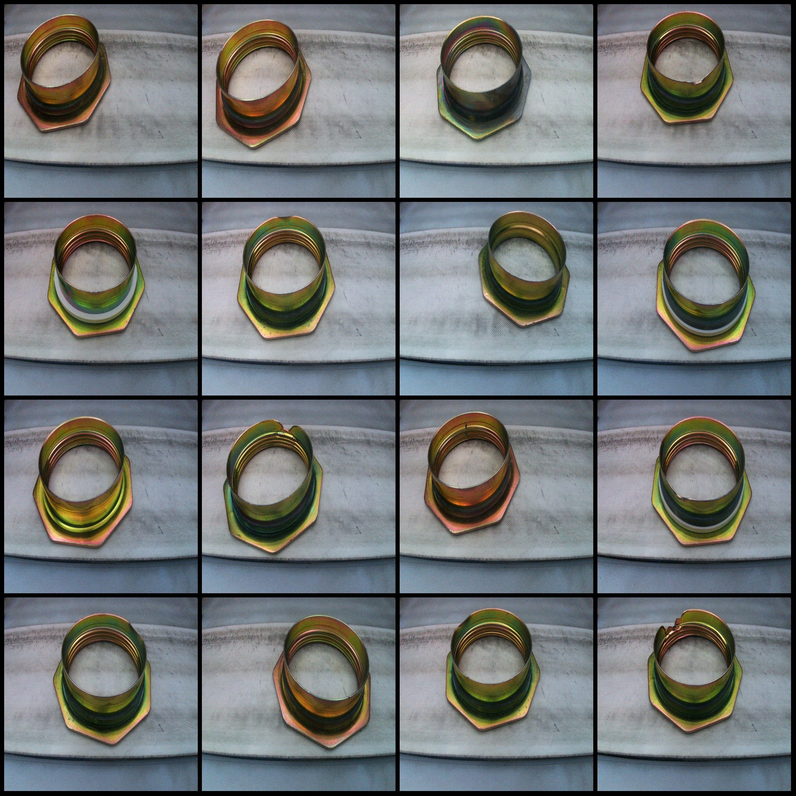
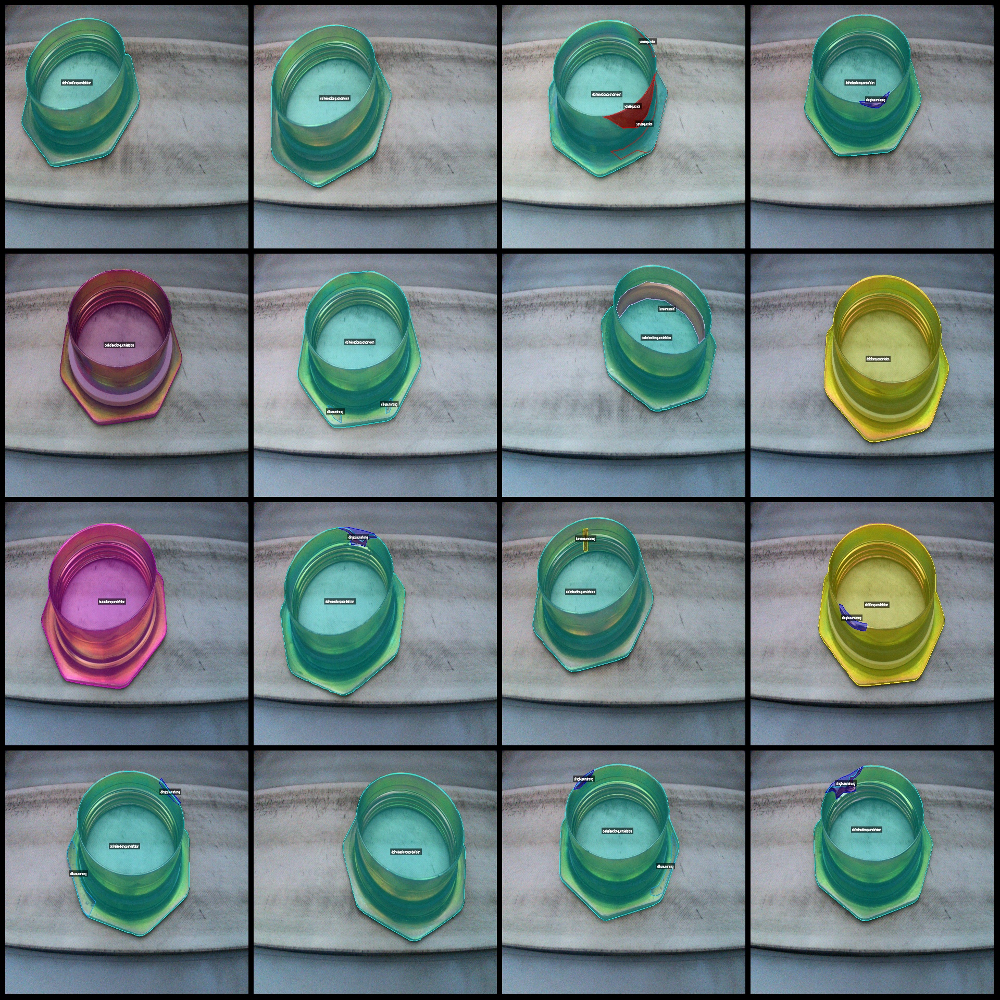
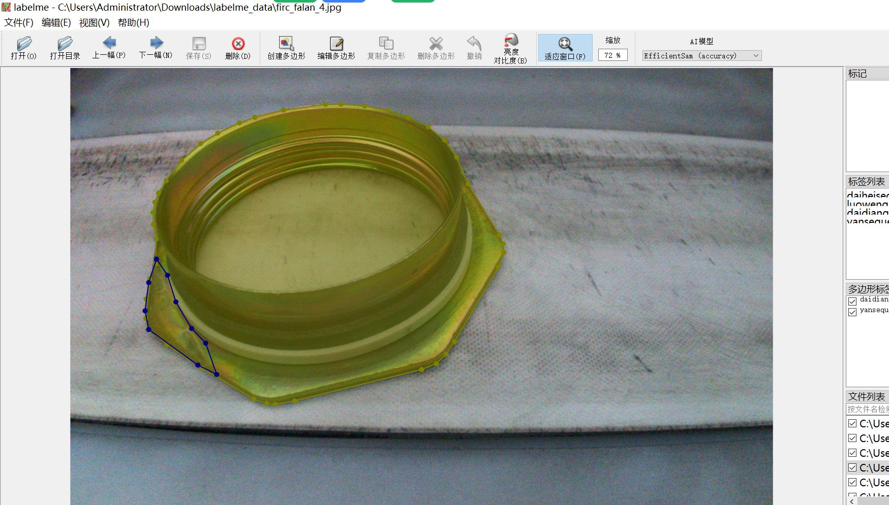

# Intelligent Industrial Part Flange Damage and Defect Identification and Segmentation Dataset with 2436 Images in LabelMe Format and 10 Categories

The dataset format is labelme format (without mask files, only jpg images and corresponding json files).

**Number of pictures:** 2436

2436

The number of categories is 10.

["budaidianquandefalan", "daibaisedianquandefalan", "daidianquandefalan", "daiheisedianquandefalan", "dibuqiekou", "dibusunshang", "dingbusunshang", "luowenqueshi", "luowensunshang", "yansequexian"]

["Bottom cut", "Bottom damage", "Color defect", "Black washer flange", "Flange with washer", "Flange without washer", "White washer flange", "Thread damage", "Thread missing", "Top damage"]

**Each category has annotated boxes:**
- budaidianquandefalan: 31
- daibisedianquandefalan: 31
- daidianquandefalan: 1170
- daiheisedianquandefalan: 1202
- dibuqiekou: 100
- dibusunshang: 187
- dingbusunshang: 1025
- luowenqueshi: 98
- luowensunshang: 212
- yansequexian: 554

**Total frames:** 4610

**Use annotation tool: ** labelme=5.5.0

**image resolution: ** 1920x1200

Annotation rules: Polygon annotation for class

**Important Note:** Dataset can be opened and edited using the labelme editor. JSON dataset needs to be converted into mask or yolo format or coco format for semantic segmentation or instance segmentation.

**Special Notice:** The dataset does not guarantee the accuracy of the trained models or weight files.

**image preview:**
(Due to the limit of this platform, only a few image preview examples are provided here.)
## Images

Here is a pay link on Stripe ( https://buy.stripe.com/3cs8yP7sY87d0vu9AB ). Please contact me lonlonago@foxmail.com after funding $89, and I will send you a complete data files , thank you!

